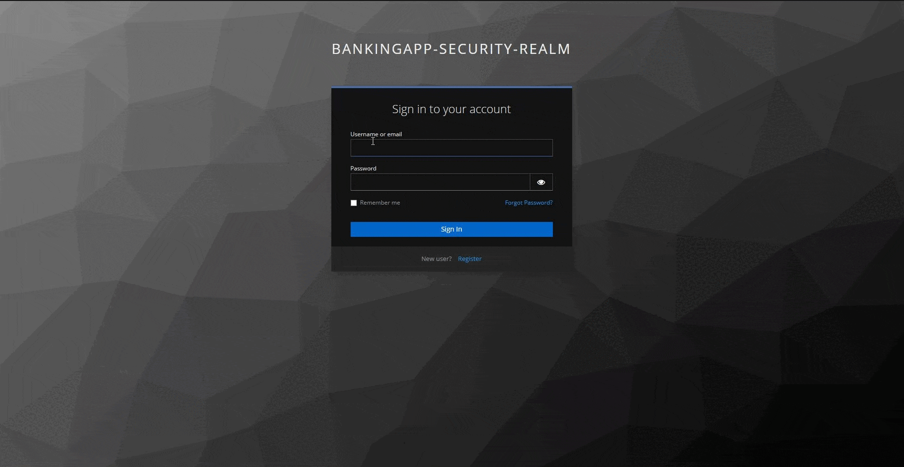

# Fullstack Spring Boot Microservices Banking App with Angular

Using Spring(boot), PostgreSQL, Hibernate, Maven. Postman/Angular used for API testing.

## Frontend Screenshot (Barebones just for testing)

## API Documentation (OpenAPI)

[Swagger UI API-Docs](https://mochahaulier.github.io/Fullstack-SpingBootMicroservices-BnakingApp-Angular/)

## Services Overview

- Client Service
- Product Service
- Client-Product Service
- Transaction Service
- API Gateway using Spring Cloud Gateway
- Simple Frontend using Angular

## Tech Stack

- Spring Boot
- API Gateway using Spring Cloud Gateway
- Angular
- PostgreSQL on Render.com
- Kafka
- Keycloak
- Grafana Stack (Prometheus, Grafana, Loki and Tempo)
- Maven
- Docker
- Devcontainer VSCode

## Application Architecture

Soon.
